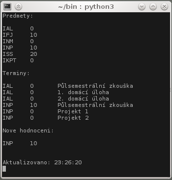

VUT FIT WIS Checker
===================

Funkce a možnosti
-----------------

- skript stahuje aktualní hodnocení z WISu a porovnává, zda se hodnocení oproti původnímu načtení změnilo
- lze nastavit libovolný příkaz na upozornění změny hodnocení
- možnost nastavit zobrazení hodnocení konkrétních termínů
- možnost nastavení spouštění skriptu ve smyčce s libovolnou frekvencí

Konfigurace
-----------

Pro nastavení skriptu se používá soubor [wis.ini](/wis.ini "wis.ini")

##### Sekce [WIS]: #####

 * Přihlašovací údaje:
    + `user` — uživatelské jméno
    + `pass` — heslo k informačnímu systému

 * Funkčnost a způsob spouštění skriptu:
    + `check` — zapnutí kontrolování nového hodnocení
    + `loop` — zapnutí spouštění ve smyčce (pokud neni zapnuté, `loopTime` nemá vliv )
    + `time` — pauza mezi opětovným spuštěním při spouštění ve smyčce (v sekundách)
    + `cmd` — přikaz, který se má použít jako notifikace

##### Sekce `[courses]` a `[terms]`: #####

 * Nastavení vypisovaných dat:
    + `course[n]` — zkratky vypisovaných předmětů (zkratky je potřeba zadat přesně jako je ve WISu)
    + `terms[n]` — URL adresy sledovaných termínů
    
#### Ukázka konfigurace: ####
    [WIS]
    user = xlogin00
    pass = he5lonaw1s
    check = True
    loop = True
    time = 90
    cmd = aplay band.wav

    [courses]
    course[0] = INP
    course[1] = INM
    course[2] = IFJ
    course[3] = IAL
    course[4] = ISS
    course[5] = IKPT

    [terms]
    term[0] = https://wis.fit.vutbr.cz/FIT/st/course-sl.php?id=525641&item=45878
    term[1] = https://wis.fit.vutbr.cz/FIT/st/course-sl.php?id=525641&item=46178

Pokud prvky v konfiguraci chybí, nebo konfigurační soubor chybí úplně, skript použije defaultní nastavení:

    check = True
    loop = True
    time = 300
    
   Přihlašovací údaje a vypisované kurzy uživatel bude moct zadat po výzvě

#### Upozornění: ####
Skript kontroluje nové hodnocení v rámci celého předmětu. Pokud nebude předmět, jehož termín je zobrazovaný, mezi zobrazovanými předměty (sekce `[courses]`), nebude na změnu hodnocení upozorněno

Screenshot
----------

  
